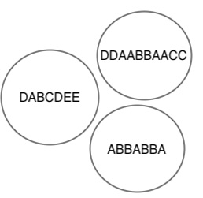

# Homework Assignment 2: Genetic Algorithms

**Due: Monday, September 22, 11:59 PM**

Genetic algorithms are a class of approaches that draw loosely from the process of evolution.
They allow us to optimize solutions to complex problems.
This week, you will write code to implement a genetic algorithm.
While your `DynamicArray` class could also do the job, we suggest you use the Java class `ArrayList` (but see Kudos below).
For further detail about how `ArrayList` works, we encourage you to reference the [online javadoc](https://docs.oracle.com/javase/8/docs/api/java/util/ArrayList.html) for this class.

We will implement the genetic algorithm using an object-oriented approach.
You can think of your `GA_Simulation` class as being the central point of control.
Using `GA_Simulation`, you will create a population of creatures of the class `Individual` that will compete with each other.
Their success or failure will be determined by rules we provide to simulate natural selection.
We expect to see the composition of the population shift over time, just like with evolutionary change.

The first step (Part 1) will be writing the code to generate an individual creature (instantiate objects of class `Individual`).
When writing the `Individual` class, you are thinking only about one creature at a time.
Each `Individual` will be defined by a sequence of characters, typically called a "chromosome" in genetic algorithms.
Each position on the chromosome corresponds to a "gene."
Genes can have different states, represented by different letters. 

Part 2 of this project will involve taking a birds-eye view by adding in the `GA_Simulation` class, allowing you to create multiple creatures comprising a population .
First, you will randomly generate individuals that make up an initial population.
Next, you will write a method to allow the creatures to reproduce via sexual reproduction (Part 2), i.e., the offspring will inherit "genes" from two parents.

However, in each generation, we will allow only the top-scoring parents to reproduce. 
To rank them, you will use a set of rules to assign each individual a "fitness" score (Part 3).
We will then apply the same rules to the next generation, only allowing those with the highest fitness to reproduce to create new offspring (Part 4). 
You will repeat this process over many generations and observe how your population changes (Part 5). 

## Part 1: Designing the `Individual` Constructor for the Initial Population

The core building block of our experiment is each individual creature.
Therefore, you should make a class called `Individual` that defines an object representing a creature.
The core data defining each creature is its "chromosome".

Each Individual has only a single copy of a single chromosome, which consists of a sequence of letters.
(In biological terms, these sexually reproducing single-chromosome creatures are haploid).
The `Individual` class should store its chromosome in an `ArrayList<Character>`.
You may also want to store the size of this ArrayList as an instance variable.

You will want to incorporate the following parameters, which are explored further in Part 5:
* The initial chromosome size, ***c_0*** (recommended setting: 8). This parameter tells you how many letters should make up the chromosomes created by this constructor.

* Number of states possible per gene, ***g*** (recommended setting: 5). This parameter tells you how many letters to choose from when you are randomly generating chromosomes.

* A seed for the random number generator, ***rng***. Seeding random number generation helps ensure that your code is reproducible. This will be generated by code provided in `main`.

These parameters should be passed to your constructor when you call it from `GA_Simulation` (see below).

### Constructor

Your first constructor will generate a chromosome of the desired length (***c_0***).
The chromosome will be made up of "genes" that are represented by randomly generated letters.
A method called `randomLetter` has been provided to help you generate a random letter from among ***g*** options.
Use this method to populate `chromosome` with randomly chosen "genes".

### View Chromosome

We have provided a `toString` method that allows you to print your `Individual`.
This method assumes that the `Individual` class has a field called `chromosome` that holds the `ArrayList` of genes.

## Part 2: Adding in Reproduction

Next, you want to create a second constructor to generate offspring by combining the genetic information from two parents.
You'll use this constructor to create the creatures in every generation after the first one. 

### Constructor

This method will be passed two objects of type `Individual` that will be parent 1 and parent 2, along with a Random object that will act as the Random Number Generator.
Here's how it should work:
* Pick a **prefix** length to use from the first parent, corresponding to between 1 and `parent1.size` characters

* Pick a **suffix** length to use from the second parent, corresponding to between 1 and `parent2.size` characters

* Identify the indices associated with the prefix (`prefixLength` counting from the beginning of parent1's chromosome) and suffix (`suffixLength` characters counting from the end of parent2's chromosome)

* Concatenate the prefix and the suffix to make a new chromosome

* Check if the new chromosome is longer than the maximum allowed chromosome length (***c_max***)

* If the result is longer than ***c_max***, truncate letters from the end until your chromosome length is ***c_max***

#### Example
Let's say we randomly select two creatures as Parent 1 and Parent 2. Parent 1's chromosome is AABB and Parent 2's chromosome is CCDD.  Your method will:
* Randomly pick a substring starting from the beginning of Parent 1's chromosome, either A, AA, AAB, or AABB 
* Randomly pick a substring starting from the end of Parent 2's chromosome, either D, DD, CDD, or CCDD

Let's say the random number generator picks 3 (AAB) then 2 (DD).
The offspring chromosome would be AABDD.

### Mutation

Mutation is an incredibly important part of real evolution.
It allows offspring to potentially avoid disadvantages their parents had.
Therefore, this second constructor should also include a step that implements mutation. 

To do this, you will go through each gene in your new chromosome and randomly determine whether it should mutate based on the mutation rate, ***m***.
To do this, you can use the provided method `doesMutate`, which will (essentially) roll a die to determine whether a mutation happens.
This method will return either `true` (change the gene) or `false` (don't change the gene).
If it is `true`, you should replace the gene with a new, randomly selected letter.

## Part 3: Calculating Fitness

We now have a constructor that allows two individuals to produce an offspring, but we need a way to selectively allow individuals to reproduce based on their fitness. 
Therefore, we need to write a method called `getFitness` that computes and returns the fitness of an individual according to certain criteria. 

Your function to evaluate fitness will have two parts:
- First, you will compare each letter to its mirror partner (i.e., the first with the last, second with the second-to-last, etc.). Each match ***increases*** fitness by 1, and each mismatch ***decreases*** fitness by 1.
    - If there are an odd number of genes in the chromosome, ***increase*** fitness by 1 for the middle gene. 

- Second, you will compare each gene with the preceding one (e.g., compare the 1st position with the 2nd, the 2nd with the 3rd, etc.)
If there is a match, ***decrease*** fitness by 1.

This  `fitness` function should return an integer that will represent the fitness score you calculated for the individual.

#### Example
Let's calculate the fitness for an individual with the chromosome ABCBBDBBDBA. 
Comparing the mirror partners gives us:
- A x A --> +1
- B x B --> +1
- C x D --> -1
- B x B --> +1
- B x B --> +1
- D x nothing (odd number) --> +1
Subtotal: +4

Comparing adjacent genes gives us:
- AB --> 0
- BC --> 0
- CB --> 0
- BB --> -1
- BD --> 0
- DB --> 0
- BB --> -1
- BD --> 0
- DB --> 0
- BA --> 0
Subtotal: -2

Total Fitness: 2

## Part 4: Creating Class `GA_Simulation`

You will now create a second class called `GA_Simulation`. This class will control your creatures at the population level. This class should have the components described below:

### Instance Variables

The experiment will be run using several parameters. We have provided suggested values that will work in parentheses:
* The number of individuals in each generation, ***n*** (100)
* The number of winners (individuals allowed to reproduce) in each generation, ***k*** (15)
* The number of rounds of evolution to run, ***r*** (100)
* The initial chromosome size, ***c_0*** (8)
* The maximum chromosome size, ***c_max*** (20)
* Chance per round of a mutation in each gene, ***m*** (0.01)
* Number of states possible per gene, ***g*** (5)

Some of these may look familiar from the `Individual` class. You will use `GA_Simulation` to pass these parameters to `Individual`.

### Constructor

`GA_Simulation` should have a single constructor that takes all the experimental parameters listed above as arguments and stores them in the appropriate fields. You do not need to make getters or setters for them, since they are for internal use only.  

### Initialize Population

For the first step, your `GA_Simulation` class will need to create the first generation using the first constructor we wrote in the class `Individual`. 
To do this, you should write a method called `init` that initializes a population of the desired size, calling the `Individual` setup constructor ***n*** times to create a population of ***n*** Individuals.
Remember to pass `rng` to the constructor.
This will be your founding generation of creatures.

### Rank Individuals According to Fitness

Next, you want to compare the fitness of all of the `Individuals` in this generation.
We have provided a method called `rankPopulation` that sorts an `ArrayList` of `Individuals` in place. This means that the original `ArrayList` that you pass it will be sorted (think about mutating vs functional methods). The end result is that your `ArrayList` is sorted according to each `Individual`'s fitness score.

### Evolve Your Population

The next method, `evolve`, selects each generation's winners (the first ***k*** elements of the population after ranking). You should do the following steps ***n*** times so that you create a generation of ***n*** offspring:
- From these ***k*** individuals, randomly select two. These will be the parents of a member of the next generation.
- Use the second constructor of `Individual` to combine information from the two parents to create a new offspring. Remember to pass `rng` to the constructor.

## Part 5: Run Your Experiment

For each generation, you want your program to output the following information in the following format:

For this final part of the experiment, you will need three additional methods in `GA_Simulation`:
* `describeGeneration` will print some statistics about the current generation.  Specifically, show the fitness of the fittest individual in the generation, the ***k***th individual, and the least fit (last ranking) individual, along with the actual chromosome of the best individual. 
Please call `printGenInfo` so that they print in a consistent format.
* `run` will run the entire experiment.  First it will initialize the population, rank it, and describe it.  Then, for each round, it will evolve the population, rank it, and describe it.
* `main` will create a new `GA_Simulation` object and run it. You can specify your parameters here.

You will run the main method from `GA_Simulation` to conduct the whole experiment.  Look at the output and play with the parameters.  How many rounds of evolution does the program take to generate a perfect palindrome?

### Summary of Steps in the Experiment

An experiment consists of the following steps:
1. Initialize the population with ***n*** individuals generated at random.
2. Rank them according to their fitness scores.
3. For each round of evolution:
    1. Determine the ***k*** winners of the previous round
    2. Generate a new generation from the old, where each new individual is the offspring of two randomly chosen winners from the previous round, with some randomly chosen mutations.  (See details below.)
    3. Rank the new generation according to their fitness score.
4. At the end of ***r*** rounds, take the individual(s) with the best fitness as the solution.

## Kudos
As an optional final step to this assignment, it would be nice to show that it can work with your own `DynamicArray` class in place of `ArrayList`.  Don't rewrite your existing classes, since we want to see them.  Instead, create copies renamed as `GA_Simulation_DA` and `Individual_DA`.  To make the shift work, you will need to address certain differences between the two array classes:
* `ArrayList` offers the mutating method `addAll`.  You will either need to add an `addAll` method to `DynamicArray` or modify `GA_Simulation_DA` to use the functional version.
* `ArrayList` has a method called `subList` that is similar to `extract`, except that it returns a shallow copy.  You can probably safely use `extract` in its place (or make one an alias for the other).
* Instead of relying on the native `sort` function provided by `ArrayList`, you will need to add a `sort` function in `DynamicArray`.  You can call the `sort` method from class `Arrays` to do the work.
* If you rely on iterators or a for-each loop in your `GA_Simulation` implementation, you may need to modify that code using indices.
